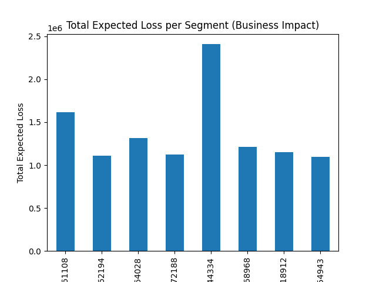
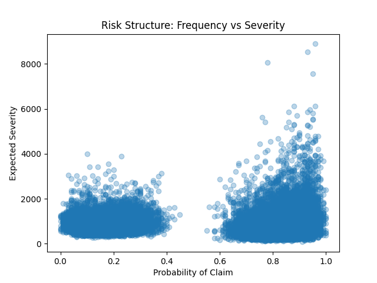
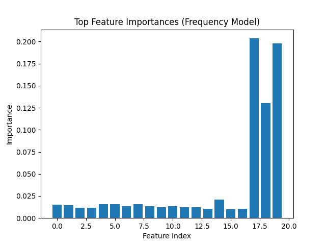
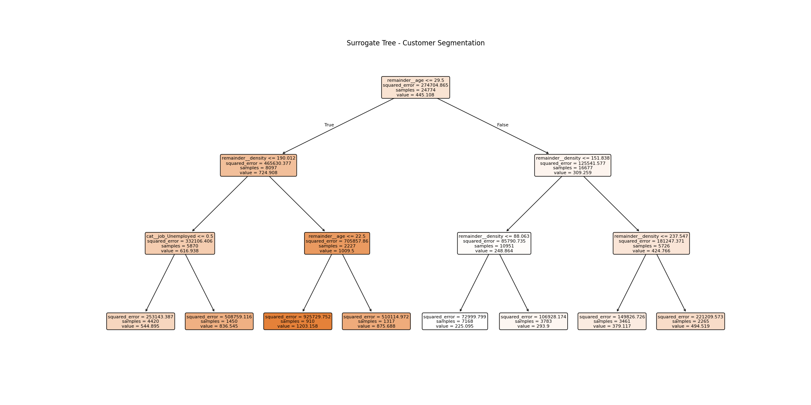
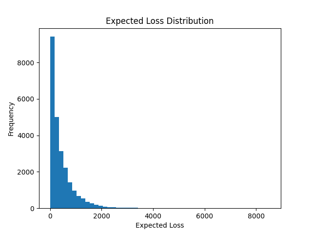
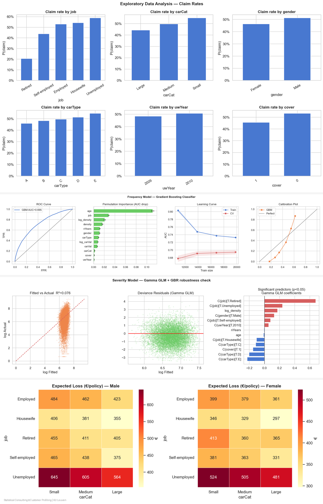

# Insurance Claim Modeling with Random Forest

## Frequency–Severity Approach

## TL;DR

> Two-part insurance risk model:
> - **Frequency** → probability of a claim  
> - **Severity** → size of a claim  

Combining both:
> **Expected Loss = Frequency × Severity**

This project applies **Random Forest models** to capture nonlinear risk patterns and analyze insurance portfolio behavior.

---

## Problem

Insurance risk is not a single prediction problem.

Instead, expected loss is modeled as:

> **Expected Cost = Frequency × Severity**

Where:
- **Frequency** = likelihood of a claim  
- **Severity** = cost given a claim  

This structure better reflects real-world insurance pricing.

---

## Methodology

### Frequency Model
- Random Forest Classifier  
- Predicts claim probability  

### Severity Model
- Random Forest Regressor  
- Predicts claim size  

### Final Output
- Combined into **Expected Loss per customer**

---

## Key Results

### Business Impact: Total Expected Loss per Segment

Some segments contribute disproportionately to total loss.  
This highlights that **portfolio concentration is as important as individual risk**.

---

### Risk Structure: Frequency vs Severity

There is a clear nonlinear relationship:
- High claim probability often coincides with high severity  
- Risk is clustered rather than evenly distributed  

---

### Feature Importance (Frequency Model)

A small number of features dominate prediction power,  
suggesting **strong underlying drivers of claim occurrence**.

---

### Interpretable Segmentation (Surrogate Tree)

A decision tree approximation of the model reveals:
- Clear segmentation rules  
- Key thresholds driving risk differences  
- Interpretable structure behind a complex model  

---

## Distribution of Expected Loss

The distribution is highly skewed:
- Most customers have low expected loss  
- A small group drives extreme risk  

This is typical in insurance and reinforces the need for segmentation.

---

## Portfolio-Level Insights

### Customer Segmentation Overview

- High-risk groups are identifiable  
- Job category, car type, and demographics affect claim behavior  
- Certain segments consistently exhibit elevated expected loss  

---

## Key Takeaways

- Modeling **frequency and severity separately** improves realism  
- Risk is **nonlinear and concentrated in specific segments**  
- Random Forest captures interactions that linear models miss  
- A small subset of customers drives a large share of total loss  

---

### 6. Interactive visualizations (`viz/`)
 
Generated by `visualize_ageas.py` from the CSVs in Statistical Consulting Github collaboration aeges, `results/`. Open any file directly in a browser — no server needed. Run the full pipeline first (`python script.py`, `python regression_analysis.py`, `python combine_methods.py`), then `python visualize_ageas.py` to produce all figures.
 
| File | Source CSV(s) | What it shows |
|---|---|---|
| **`viz/00_DASHBOARD.html`** | all five CSVs | 12-panel combined overview: bar, heatmap, R² curve, regression coefficients, cluster bubbles, pie, cell scatter, Lorenz curve, size-vs-loss scatter, donut, and boxplot — one page to share with any audience. |
| **`viz/01_portfolio_bar.html`** | `surrogate_tree_segments.csv` | Bar chart of all M5 segments sorted by mean expected loss, colour-coded by recommended action (retain / monitor / candidate / flag). Hover shows policy count, percentage of portfolio, and total risk exposure. |
| **`viz/02_age_density_heatmap.html`** | *(derived from surrogate tree rules — no CSV)* | Continuous risk surface over age × population density, computed directly from the 8-leaf surrogate tree split conditions. White dashed lines mark every decision boundary (age 22.5, 29.5; density 87.5, 151.8, 190.0). |
| **`viz/03_sunburst_hierarchy.html`** | `surrogate_tree_segments.csv` | Nested sunburst showing how the 24,774 policyholders are partitioned at each tree split: root → age → density → job / action. Segment sizes taken from actual CSV counts. |
| **`viz/04_segment_radar.html`** | `surrogate_tree_segments.csv` | Radar / spider chart with one trace per M5 segment across six dimensions: risk level, portfolio share, age proxy, density proxy, exposure concentration, and action priority. |
| **`viz/05_sankey_flow.html`** | `surrogate_tree_segments.csv` | Sankey diagram tracing policyholder volume from the root split through intermediate nodes to each leaf segment. Node widths and link opacities are proportional to actual policy counts from the CSV. |
| **`viz/06_forest_plot.html`** | `expected_loss_regression.csv` | Forest plot of log-OLS regression coefficients (all terms except the intercept), with 95% confidence intervals where available. Red = positive effect on expected loss, green = negative, grey = not significant (p ≥ 0.05). Hover shows the plain-language interpretation string from the CSV. |
| **`viz/07_cluster_bubbles.html`** | `risk_bands_clusters.csv` | Bubble scatter: x = mean cluster age, y = mean expected loss, bubble size ∝ number of customers. Grouped by risk band (Low / Medium / High). A shaded band marks the young-driver zone (age 18–29.5). |
| **`viz/08_cell_scatter.html`** | `covariate_cells.csv` | Scatter of all covariate cells: x = cell claim frequency, y = cell average severity, colour = expected loss. Sparse cells (n < 30 severity observations) marked with a distinct symbol. Up to 2,000 cells sampled for rendering performance. |
| **`viz/09_r2_grid.html`** | *(hardcoded from `st.grid_results` printed output — no CSV)* | Holdout R² as a function of `max_leaf_nodes` for the surrogate tree grid search. The selected model (24 leaves, R² = 0.70) is starred; the previous iteration best (12 leaves, R² = 0.66) is marked with a diamond. |
| **`viz/10_m4_m5_heatmap.html`** | `m4_m5_agreement.csv` | Row-normalised heatmap of the M4 × M5 cross-method assignment matrix. Each cell shows raw customer count and the share of that M4 segment assigned to each M5 segment. High diagonal concentration = strong method agreement. |
| **`viz/11_3d_surface.html`** | *(derived from surrogate tree rules — no CSV)* | Fully interactive 3-D surface: age × population density × expected loss. Rotate, zoom, and hover to read exact predicted values. Contour projection on the floor plane highlights risk ridges. |
 
---
 
